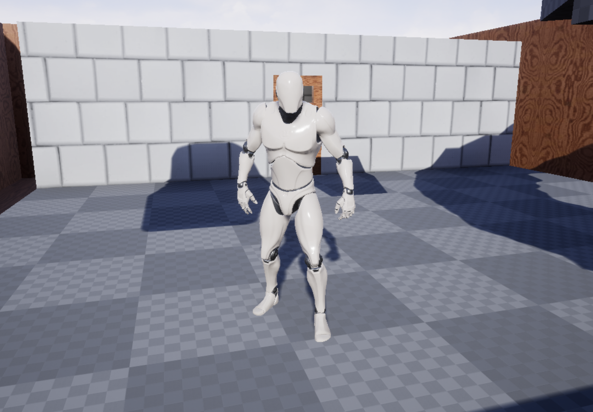

# Garden


* 3rd Person Multiplayer Game in Unreal Engine 4. Includes:
  * Main menu
  * In-game menus
  * Volume triggered door
  * replicated cube platform
  * replicated phyisics football
  * Xmas tree model from [Wordofcurse](https://sketchfab.com/Wordofcurse)
  * Sergio model from [Tio_de_rojo](https://gamebanana.com/members/1587288)
  * Feliz navidad audio by Jose Feliciano
* Download executable [here](https://kikizana.itch.io/garden)

# Install instructions

To play unzip the client file of your OS and run Garden.exe on windows or cd into the directory and run on Linux:

```
./Garden.sh
```

You can host a dedicated server on linux by unzipping the server file and running in the relevant directory:

```
./GardenServer.sh
```

To host games, either as client by clicking host or per the dedicated server executable, you need to have port `7777` open.

You don't have to append the port to the IP Address of a server, i.e.the following addresses are correct examples:

* Local host: `127.0.0.1`
* Sample local IP Address: `192.168.1.10`
* Domain name address: `kpan.nl`